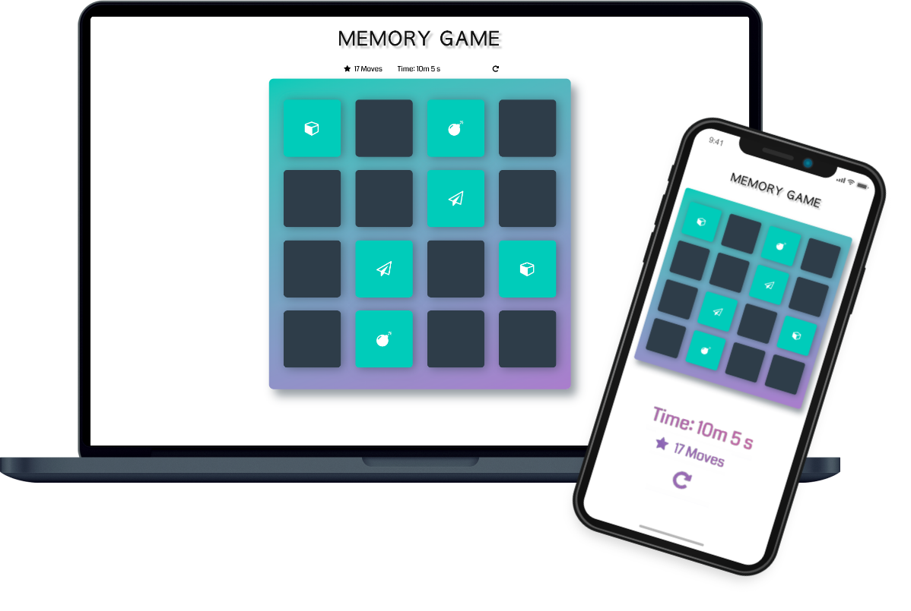

# Memory Game Project
This classical memory game was created in vanilla JavaScript. 
The goal is to find and match all 16 cards as fast as possible, with the possibilty to choose two cards on every try. 
When finished a popup window appears and shows rating and total time spent.

## Table of Contents
* [Instructions](#instructions)

## Instructions

<strong>Option 1</strong>
1. Open this live version <a href="https://filmol.github.io/FM-Portfolio/Memory_Game/index.html">Memory Game</a> in your optional browser.
2. Exercise your brain and memory! 🥳

<strong>Option 2</strong>
1. Download the whole directory. 
2. Open the "index.html" file on your optional browser.
3. Exercise your brain and memory! 🥳
